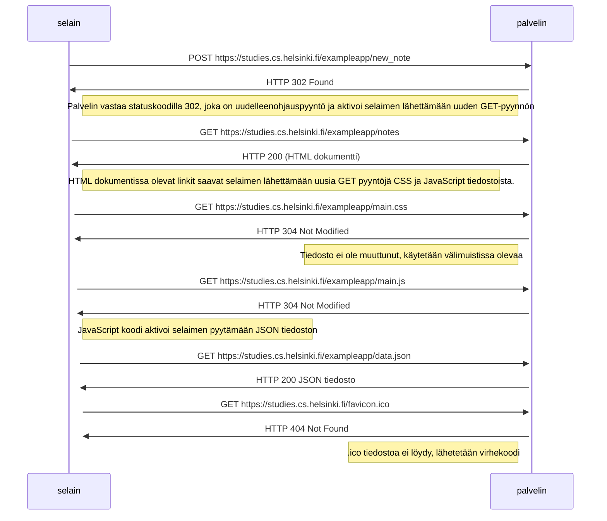

Sekvenssikaavio kun käyttäjä luo uuden muistiinpanon example-apissa.

```mermaid
sequenceDiagram
participant selain
participant palvelin

selain->>palvelin: POST https://studies.cs.helsinki.fi/exampleapp/new_note 
activate palvelin
palvelin->>selain: HTTP 302 Found

Note left of palvelin: Palvelin vastaa statuskoodilla 302, joka on uudelleenohjauspyyntö ja aktivoi selaimen lähettämään uuden GET-pyynnön

activate selain
selain->>palvelin: GET https://studies.cs.helsinki.fi/exampleapp/notes 
activate palvelin
palvelin->>selain: HTTP 200 (HTML dokumentti)
activate selain

Note right of selain: HTML dokumentissa olevat linkit saavat selaimen lähettämään uusia GET pyyntöjä CSS ja JavaScript tiedostoista.

selain->>palvelin: GET https://studies.cs.helsinki.fi/exampleapp/main.css 
activate palvelin
palvelin->>selain: HTTP 304 Not Modified

Note left of palvelin: Tiedosto ei ole muuttunut, käytetään välimuistissa olevaa

activate selain
selain->>palvelin: GET https://studies.cs.helsinki.fi/exampleapp/main.js 
activate palvelin
palvelin->>selain: HTTP 304 Not Modified
activate selain

Note right of selain: JavaScript koodi aktivoi selaimen pyytämään JSON tiedoston

selain->>palvelin: GET https://studies.cs.helsinki.fi/exampleapp/data.json
activate palvelin
palvelin->>selain: HTTP 200 JSON tiedosto
activate selain
selain->>palvelin: GET https://studies.cs.helsinki.fi/favicon.ico
activate palvelin
palvelin->>selain: HTTP 404 Not Found

Note left of palvelin: .ico tiedostoa ei löydy, lähetetään virhekoodi
```
