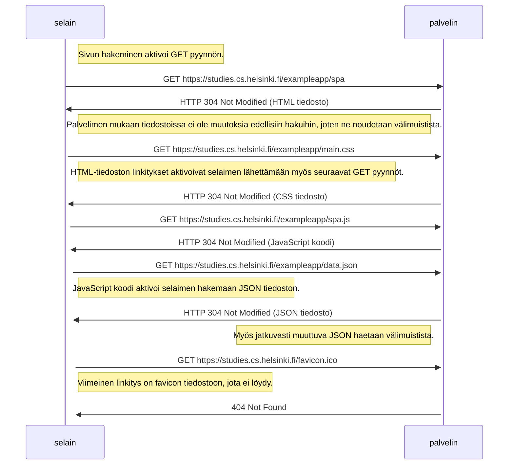

Sekvenssikaavio, kun käyttäjä siirtyy selaimella examplen Single Page Appiin

```mermaid
sequenceDiagram
participant selain
participant palvelin

Note right of selain: Sivun hakeminen aktivoi GET pyynnön.

selain->>palvelin: GET https://studies.cs.helsinki.fi/exampleapp/spa 
activate palvelin
palvelin->>selain: HTTP 304 Not Modified (HTML tiedosto)

Note left of palvelin: Palvelimen mukaan tiedostoissa ei ole muutoksia edellisiin hakuihin, joten ne noudetaan välimuistista. 

activate selain
selain->>palvelin: GET https://studies.cs.helsinki.fi/exampleapp/main.css

Note right of selain: HTML-tiedoston linkitykset aktivoivat selaimen lähettämään myös seuraavat GET pyynnöt.

activate palvelin
palvelin->>selain: HTTP 304 Not Modified (CSS tiedosto)
activate selain
selain->>palvelin: GET https://studies.cs.helsinki.fi/exampleapp/spa.js 
activate palvelin
palvelin->>selain: HTTP 304 Not Modified (JavaScript koodi)
activate selain
selain->>palvelin: GET https://studies.cs.helsinki.fi/exampleapp/data.json 

Note right of selain: JavaScript koodi aktivoi selaimen hakemaan JSON tiedoston.

activate palvelin
palvelin->>selain: HTTP 304 Not Modified (JSON tiedosto) 

Note left of palvelin: Myös jatkuvasti muuttuva JSON haetaan välimuistista.

activate selain
selain->>palvelin: GET https://studies.cs.helsinki.fi/favicon.ico

Note right of selain: Viimeinen linkitys on favicon tiedostoon, jota ei löydy.

activate palvelin
palvelin->>selain: 404 Not Found

```
