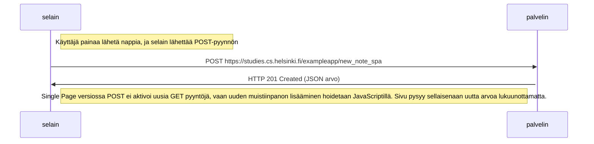

Sekvenssikaavio kun käyttäjä luo uuden muistiinpanon examplen Single Page Apissa.

```mermaid
sequenceDiagram
participant selain
participant palvelin

Note right of selain: Käyttäjä painaa lähetä nappia, ja selain lähettää POST-pyynnön 

selain->>palvelin: POST https://studies.cs.helsinki.fi/exampleapp/new_note_spa 
activate palvelin
palvelin->>selain: HTTP 201 Created (JSON arvo)

Note left of palvelin: Single Page versiossa POST ei aktivoi uusia GET pyyntöjä, vaan uuden muistiinpanon lisääminen hoidetaan JavaScriptillä. Sivu pysyy sellaisenaan uutta arvoa lukuunottamatta.
```
